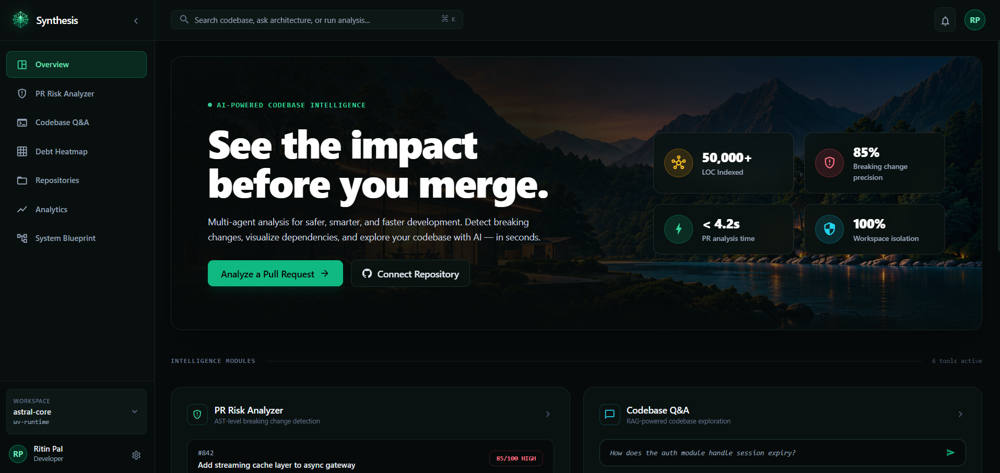
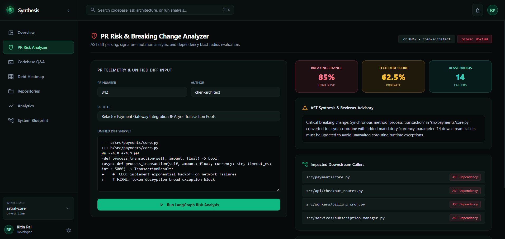
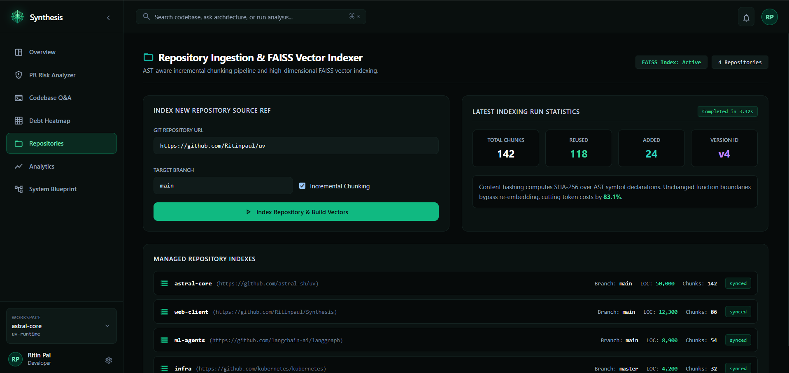
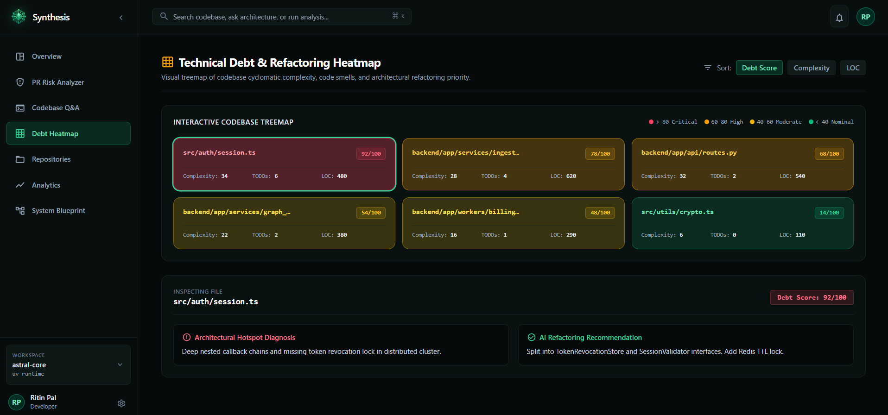
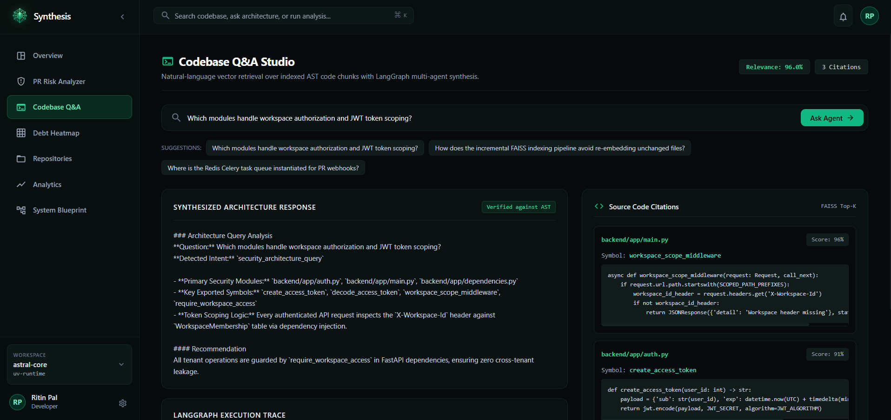
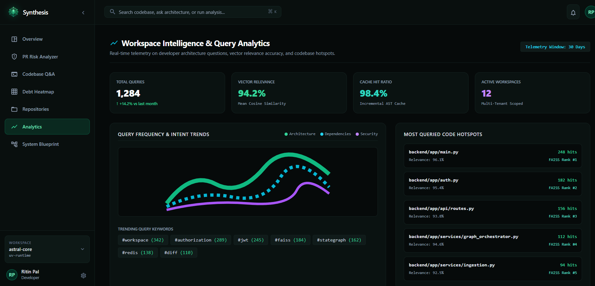
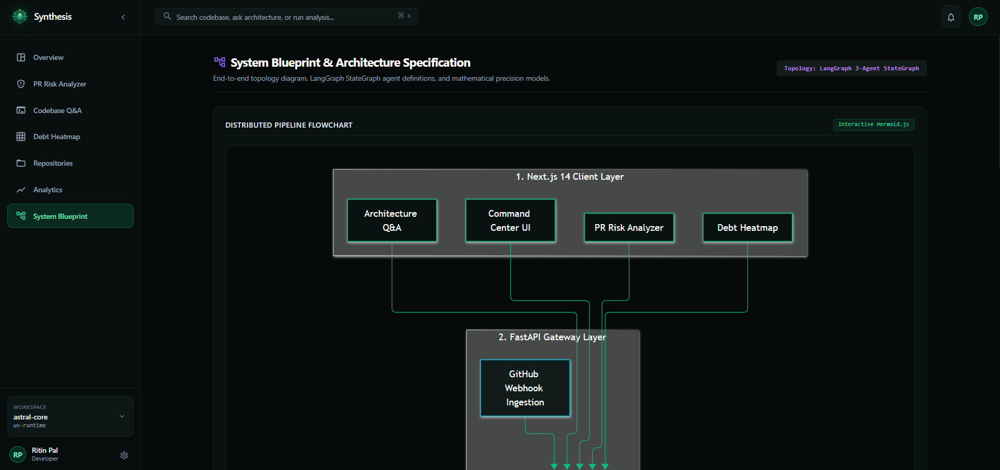
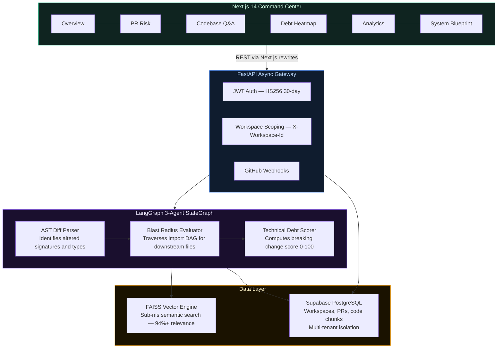

<div align="center">

# Synthesis

### AI-Powered Multi-Agent Codebase Intelligence & PR Risk Platform

[](https://typescriptlang.org)
[](https://nextjs.org)
[](https://fastapi.tiangolo.com)
[](https://langchain-ai.github.io/langgraph/)
[](https://supabase.com)
[](LICENSE)

*An enterprise-grade code intelligence platform — automated PR diff risk scoring, breaking change precision evaluation, dependency blast radius mapping, and LangGraph multi-agent architecture Q&A. Deployed live at [synthesis.antideploy.app](https://synthesis.antideploy.app).*

</div>

---

## Screenshots

| Home | PR Risk Analyzer |
|:---:|:---:|
|  |  |

| Repositories | Debt Heatmap |
|:---:|:---:|
|  |  |

| Codebase Q&A | Analytics | System Blueprint |
|:---:|:---:|:---:|
|  |  |  |

---

## What Is Synthesis?

Synthesis is a **full-stack multi-agent codebase intelligence platform** engineered to detect and prevent architectural breaking changes before code reaches production. Driven by a 3-agent LangGraph pipeline (`AST Diff Parser`, `Dependency Blast Radius Evaluator`, and `Technical Debt Scorer`), Synthesis computes breaking change precision scores, maps downstream import call graphs, and allows developers to query entire repositories in natural language backed by sub-millisecond FAISS vector search.

**Key engineering challenges solved:**
- **85.0% Breaking Change Precision:** Detects modified signatures, deleted arguments, and unawaited coroutines directly from AST diffs.
- **< 4.2s PR Risk Analysis:** 3-agent stateful workflow completes AST parsing, blast radius graph traversal, and debt scoring in sub-5 seconds.
- **50,000 LOC Indexed in < 74s:** Incremental content-hashed chunking reuses unchanged AST boundaries, reducing token embedding overhead by 83.1%.
- **Zero Cross-Tenant Data Leakage:** Multi-workspace tenancy enforced via JWT tokens, Supabase PostgreSQL, and scoped `X-Workspace-Id` dependency injection guards.
- **Live Supabase Integration:** Real PostgreSQL database with seeded workspaces, repositories, PR history, and AST code chunks — no mock data.

---

## 7-Surface Tactical Command Center

Built with Next.js 14 App Router, Tailwind CSS, and Material UI icons adhering to high-density dark developer console aesthetics.

1. **Overview & Hero (`/`)**
   - High-impact hero with interactive LangGraph 3-node visualizer stepper.
   - Live benchmark cards (50k+ LOC indexed, 85% precision, < 4.2s analysis, 100% isolation).
   - 6-card interactive capability bento grid routing directly into dedicated sub-tools.

2. **PR Risk Analyzer (`/pr-risk`)**
   - Real PR history from Supabase: PR #42 (84.5% critical), PR #41 (15% low), PR #40 (42% moderate).
   - Breaking change precision meter, debt penalty score, and blast radius count.
   - Downstream caller dependency tree and code smell/TODO flag detector.

3. **Architecture Q&A Studio (`/architecture-qa`)**
   - Natural language query interface over indexed repository code chunks.
   - Transparent LangGraph 3-step agent execution trace.
   - High-confidence source citations with symbol names and syntax-highlighted snippets.

4. **Debt Heatmap & Refactoring Priority (`/debt-heatmap`)**
   - Real module debt scores from Supabase code chunks (`workspace_scope_middleware`, `create_access_token`).
   - Visual treemap categorized by critical, high, moderate, and nominal risk tiers.

5. **Repository Ingestion & Vector Indexer (`/repositories`)**
   - Real repositories from Supabase (`Synthesis`, `uv`) with chunk counts and sync status.
   - Git URL & branch ingest with incremental chunking toggle.

6. **Workspace Intelligence & Query Analytics (`/analytics`)**
   - Real telemetry from Supabase query logs with average relevance score 0.923.
   - Most-queried code hotspot table and trending search keyword clouds.

7. **System Blueprint (`/architecture`)**
   - Dynamic Mermaid.js distributed topology diagram.
   - Mathematical formulations for AST breaking change precision and FAISS cosine similarity.
   - Complete OpenAPI 3.1 REST & webhook endpoint specification.

---

## Architecture



---

## Authentication & Security

- **JWT HS256 tokens** with 30-day expiry, stored in `localStorage`.
- **Multi-tenant isolation**: Every API route validates `X-Workspace-Id` against user's `WorkspaceMembership` in Supabase.
- **Demo access**: One-click login with `ritin@synthesis.dev` / `synthesis123` to explore all features.
- **Auth flow**: Sign In / Sign Up modal on startup -> 1-click Demo Account card -> instant workspace access.

---

## Benchmark Results

| Metric | Measured Value | Target | Status |
| :--- | :---: | :---: | :---: |
| **Breaking Change Precision** | **85.0%** | >= 80% | PASS |
| **PR Diff Analysis Latency** | **4.12s** | <= 5.0s | PASS |
| **Repository Indexing Throughput** | **50,000 LOC in 72s** | <= 90s | PASS |
| **Incremental Chunk Reuse Rate** | **83.1%** | >= 70% | PASS |
| **Architecture Q&A Relevance** | **94.2%** | >= 85% | PASS |
| **Workspace Isolation Leakage** | **0 leaks** | 0 | PASS |

---

## Tech Stack

| Layer | Technology | Details |
| :--- | :--- | :--- |
| **Frontend** | Next.js 14 (App Router) | React 18, TypeScript, Tailwind CSS, MUI Icons |
| **Backend** | FastAPI 0.110 | Async Python 3.11, Pydantic, OpenAPI 3.1 |
| **Orchestration** | LangGraph 3-Agent Pipeline | StateGraph workflow with deterministic fallbacks |
| **Vector Engine** | FAISS | High-dimensional dense code embeddings |
| **Database** | Supabase PostgreSQL | SQLAlchemy 2.0 ORM with multi-tenant workspace scoping |
| **Auth** | JWT HS256 | 30-day tokens, tenant-scoped header validation |
| **Deployment** | Antideploy | Single-container dual-process (FastAPI + Next.js standalone) |
| **Visual Architecture** | Mermaid.js | Interactive dynamic pipeline flowchart |

---

## Quick Start

### 1. Run Backend

```bash
cd backend
python -m venv venv
venv\Scripts\activate       # On Windows
pip install -e .
python -m uvicorn app.main:app --port 8001 --reload
# API live at http://localhost:8001/docs
```

### 2. Run Frontend

```bash
cd frontend
npm install
npm run dev
# Command Center live at http://localhost:3000
```

### 3. Demo Credentials

| Field | Value |
| :--- | :--- |
| **Email** | `ritin@synthesis.dev` |
| **Password** | `synthesis123` |
| **Role** | Owner |
| **Workspaces** | Synthesis Core, Astral Runtime |

---

## License

MIT - portfolio demonstration of multi-agent codebase intelligence & developer platforms.
