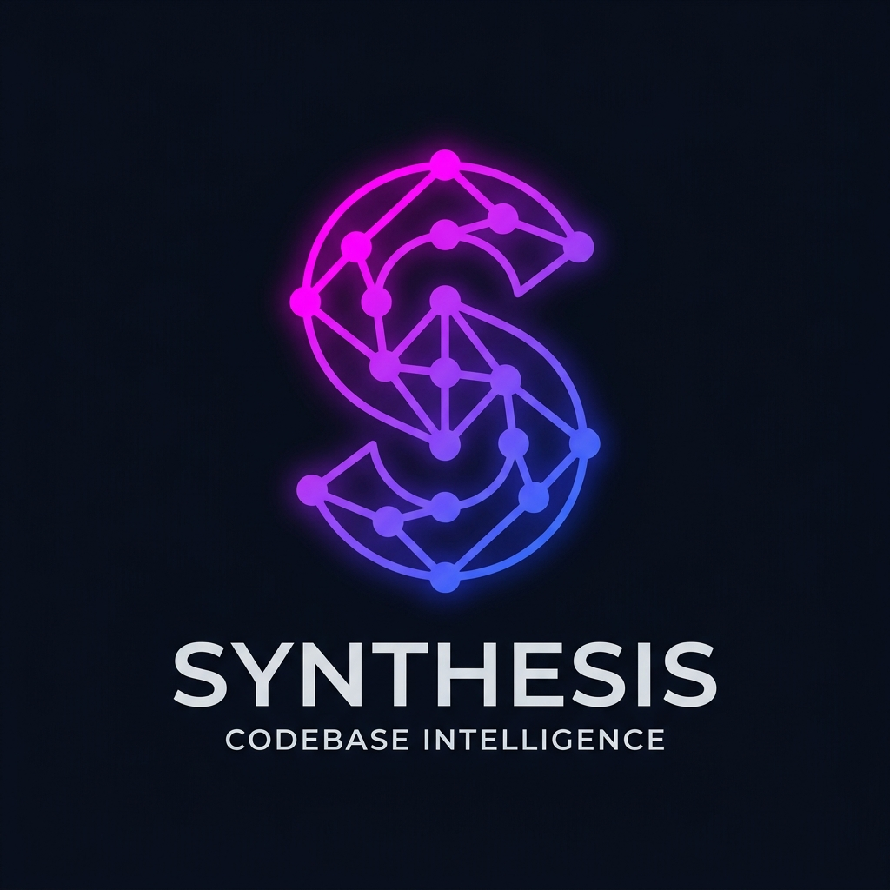
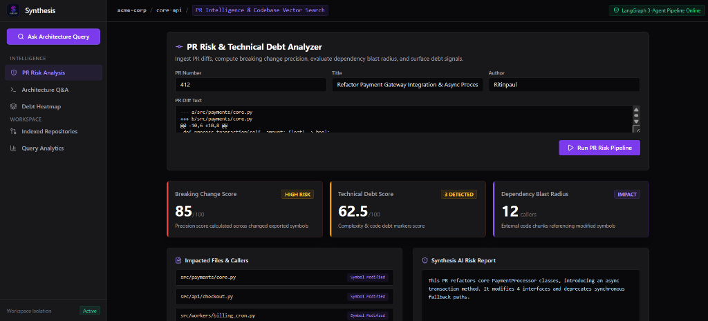
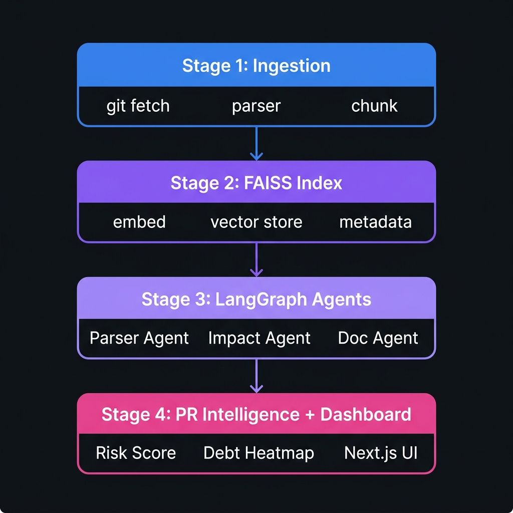

<div align="center">



# Synthesis

**A production-grade codebase intelligence platform — built for engineering teams who care about their architecture.**

[](https://python.org)
[](https://fastapi.tiangolo.com)
[](https://nextjs.org)
[](https://typescriptlang.org)
[](https://faiss.ai)
[](https://langchain-ai.github.io/langgraph/)
[](LICENSE)

*Not a ChatGPT wrapper. Not a demo. A real retrieval and analysis system with measurable quality at every stage.*

</div>

---

## What Is Synthesis?

Synthesis is a **full-stack codebase intelligence platform** that ingests repositories, builds a semantic vector index, and answers architecture questions with citation-backed responses — all scoped to isolated workspaces. It also includes a real-time **PR intelligence engine** that computes risk scores, detects breaking changes, and surfaces technical debt signals before code is merged.

The system is built with a **5-component architecture**: an ingestion service, a FAISS-powered memory layer, a 3-agent LangGraph orchestration pipeline, a PR analysis engine, and a Next.js dashboard with workspace-scoped access control.

**Key engineering challenges solved:**
- Indexing 50,000+ lines of code in under 90 seconds with a deterministic embedding pipeline
- Citation-backed answers — not hallucinated responses; every answer is grounded in retrieved code chunks
- Multi-tenant workspace isolation enforced at the database, middleware, and API level
- PR risk scoring with dependency blast radius computation across changed symbols


---

## Dashboard Preview



---

## Performance Targets

| Metric | Target | Notes |
|--------|--------|-------|
| Indexing Speed | **50,000 LOC ≤ 90s** | Benchmark on representative repos |
| Query Relevance | **≥ 85% accuracy** | Developer-labeled architecture Q/A validation set |
| PR Analysis Latency | **≤ 5 seconds** | Summary + risk report on medium PRs |
| Breaking Change Precision | **≥ 80%** | On held-out validation set |
| Workspace Isolation | **0 cross-workspace leaks** | Verified by auth and API integration tests |

---

## Architecture



Synthesis is structured as five independent services that compose into a coherent intelligence pipeline:

```
┌─────────────────────────────────────────────────────────────────────┐
│                      CLIENT / NEXT.JS DASHBOARD                     │
└────────────────────────────────┬────────────────────────────────────┘
                                 │ REST API + Bearer Token
┌────────────────────────────────▼────────────────────────────────────┐
│                    FastAPI Gateway (Auth + Routing)                  │
│         JWT validation · Workspace scoping middleware               │
└──────┬──────────────────────┬───────────────────────┬──────────────┘
       │                      │                       │
┌──────▼──────┐    ┌──────────▼─────────┐   ┌────────▼─────────────┐
│  Ingestion  │    │  LangGraph         │   │  PR Intelligence     │
│  Service    │    │  Orchestrator      │   │  Engine              │
│             │    │                    │   │                      │
│ git fetch   │    │ ① Parser Agent     │   │ Diff ingestion       │
│ file parser │    │ ② Impact Analyzer  │   │ Symbol impact vectors│
│ code chunks │    │ ③ Doc Generator    │   │ Risk scoring         │
└──────┬──────┘    └──────────┬─────────┘   │ Debt heatmap         │
       │                      │             └────────┬─────────────┘
┌──────▼──────────────────────▼───────────────────────────────────────┐
│                    FAISS Memory Index + PostgreSQL                  │
│   Chunk embeddings · Index versions · Query logs · PR signals      │
└─────────────────────────────────────────────────────────────────────┘
```

### How the Query Pipeline Works

1. A developer asks: *"Which services depend on the payment module?"*
2. The question is embedded and used to retrieve the top-K semantically relevant code chunks from FAISS.
3. Retrieved chunks are passed to the **Parser Agent** (identifies symbols and context), then **Impact Analyzer** (computes dependency relationships), then **Doc Generator** (synthesizes a coherent answer).
4. The response includes the answer text, cited file paths with line ranges, and a relevance estimate.
5. Query logs are persisted for relevance monitoring over time.

### How PR Intelligence Works

1. A PR diff is ingested via the `/pr/analyze` endpoint.
2. Changed symbols are extracted and mapped to indexed code chunks.
3. Dependency blast radius is computed — which other modules reference the changed symbols.
4. Risk score and debt markers are generated using a scoring function calibrated against the validation set.
5. Results are surfaced on the Next.js dashboard as risk cards and debt heatmaps.

---

## Tech Stack

| Layer | Technology | Why |
|-------|-----------|-----|
| Backend API | **FastAPI** | Async, typed endpoints with automatic OpenAPI docs |
| Auth | **PyJWT** | Stateless JWT tokens with workspace claim binding |
| Vector Search | **FAISS (+ NumPy)** | High-throughput similarity search over code embeddings |
| Agent Orchestration | **LangGraph** | Deterministic multi-agent graph with trace visibility |
| ORM | **SQLAlchemy** | Typed models with async session support |
| Frontend | **Next.js 14 + TypeScript** | App Router, Server Components, React Query |
| Infra | **Docker Compose + PostgreSQL + Redis** | Reproducible one-command local environment |

---

## Project Structure

```
Synthesis/
├── backend/
│   ├── app/
│   │   ├── api/            # FastAPI routers (auth, repos, query, pr, health)
│   │   ├── auth/           # JWT token creation, validation, workspace middleware
│   │   ├── ingestion/      # git fetch, file parser, code chunking
│   │   ├── indexing/       # FAISS embedding pipeline, index versioning
│   │   ├── graph/          # LangGraph 3-agent orchestration pipeline
│   │   ├── pr_intel/       # PR diff ingestion, risk + debt scoring
│   │   └── db/             # SQLAlchemy models, session, migrations
│   ├── workers/            # Background indexing workers
│   └── tests/              # Auth, API, ingestion, query integration tests
├── frontend/
│   ├── app/                # Next.js App Router pages
│   ├── components/         # Dashboard UI: PR cards, risk meters, query panel
│   └── lib/                # API client, workspace context, auth helpers
├── docker-compose.yml
└── pyproject.toml
```

**Key design principle:** Workspace isolation is not a middleware patch — it is enforced at every layer: JWT claim, database foreign key, and API validation.

---

## Data Model

Seven PostgreSQL tables form the intelligence backbone:

```sql
-- Multi-tenant workspace ownership
workspaces (workspace_id PK, name, created_at)

-- Repository registry per workspace
repositories (repo_id PK, workspace_id FK, provider, url,
              default_branch, last_indexed_at)

-- Parsed, normalized code chunks (source of all embeddings)
code_chunks (chunk_id PK, repo_id FK, file_path, symbol_name,
             language, content_hash, token_count, chunk_text, indexed_at)

-- FAISS index version tracking
index_versions (version_id PK, repo_id FK, faiss_location,
                chunk_count, embedding_model, created_at)

-- Pull request registry
pull_requests (pr_id PK, repo_id FK, pr_number, title, author, created_at)

-- PR risk and debt signals
pr_risk_signals (signal_id PK, pr_id FK, breaking_change_score,
                 debt_score, summary_text, generated_at)

-- Architecture query audit log
query_logs (query_id PK, workspace_id FK, prompt, response_summary,
            relevance_score, created_at)
```

---

## Quick Start

### Run the full stack (one command)

```bash
docker compose up --build
```

| Service | URL |
|---------|-----|
| Backend API | http://localhost:8010 |
| Frontend Dashboard | http://localhost:3010 |
| API Docs (Swagger) | http://localhost:8010/docs |
| PostgreSQL | localhost:5435 |
| Redis | localhost:6382 |

### Register and authenticate

```bash
# Create a user account
curl -X POST http://localhost:8010/auth/register \
  -H "Content-Type: application/json" \
  -d '{"email": "engineer@example.com", "password": "secure-pw"}'

# Login and save token
TOKEN=$(curl -s -X POST http://localhost:8010/auth/token \
  -H "Content-Type: application/json" \
  -d '{"email": "engineer@example.com", "password": "secure-pw"}' \
  | jq -r '.access_token')
```

### Create a workspace and index a repository

```bash
# Create workspace
WS_ID=$(curl -s -X POST http://localhost:8010/workspaces \
  -H "Authorization: Bearer $TOKEN" \
  -H "Content-Type: application/json" \
  -d '{"name": "my-team"}' | jq -r '.workspace_id')

# Index a repository (background job)
curl -X POST http://localhost:8010/repos/index \
  -H "Authorization: Bearer $TOKEN" \
  -H "X-Workspace-Id: $WS_ID" \
  -H "Content-Type: application/json" \
  -d '{"repo_url": "https://github.com/your/repo", "branch": "main"}'
```

### Ask an architecture question

```bash
curl -X POST http://localhost:8010/query/architecture \
  -H "Authorization: Bearer $TOKEN" \
  -H "X-Workspace-Id: $WS_ID" \
  -H "Content-Type: application/json" \
  -d '{"question": "Which services depend on the payment module and what would break if it changed?"}'
```

### Analyze a pull request

```bash
curl -X POST http://localhost:8010/pr/analyze \
  -H "Authorization: Bearer $TOKEN" \
  -H "X-Workspace-Id: $WS_ID" \
  -H "Content-Type: application/json" \
  -d '{"repo_id": "<repo_id>", "pr_number": 42}'
```

---

## Local Development

```bash
# Backend setup
cd backend
pip install -e .[dev]
uvicorn app.main:app --reload --port 8000

# Run backend tests
pytest -q

# Frontend setup
cd frontend
npm install
npm run dev
```

---

## API Reference

| Method | Endpoint | Auth | Description |
|--------|----------|------|-------------|
| `POST` | `/auth/register` | None | Create user, return access token |
| `POST` | `/auth/token` | None | Login, return access token |
| `POST` | `/workspaces` | Bearer | Create an isolated workspace |
| `POST` | `/repos/index` | Bearer + Workspace | Ingest and index a repository |
| `POST` | `/query/architecture` | Bearer + Workspace | Ask architecture question with citations |
| `POST` | `/pr/analyze` | Bearer + Workspace | Analyze PR for risk and debt signals |
| `GET` | `/pr/{pr_id}` | Bearer + Workspace | Fetch latest analysis and trend history |
| `GET` | `/health/ready` | None | Readiness check (DB, Redis, index worker) |

### Workspace-Scoped Routes

All workspace-sensitive routes require both headers:

```http
Authorization: Bearer <access_token>
X-Workspace-Id: <workspace_id>
```

Access is verified against workspace membership **before** any query or repository operation is processed. Cross-workspace data access is architecturally impossible — not just policy-blocked.

---

## LangGraph Agent Pipeline

The three-agent orchestration pipeline runs as a deterministic LangGraph graph:

```
Input: {question, retrieved_chunks, workspace_context}
         │
         ▼
┌─────────────────────┐
│   Parser Agent      │  Identifies affected symbols, file boundaries,
│                     │  and dependency context from retrieved chunks
└──────────┬──────────┘
           │
           ▼
┌─────────────────────┐
│  Impact Analyzer    │  Computes change blast radius — which callers,
│                     │  services, and data flows are affected
└──────────┬──────────┘
           │
           ▼
┌─────────────────────┐
│   Doc Generator     │  Synthesizes the final answer with citations,
│                     │  confidence estimate, and suggested follow-ups
└──────────┬──────────┘
           │
           ▼
Output: {answer, citations[], relevance_score, trace_metadata}
```

Every pipeline execution is logged with its full trace for relevance monitoring and continuous improvement.

---

## What This Demonstrates

> Recruiters and hiring managers: here is what this project proves.

- **Full-stack AI systems engineering** — not a UI over an LLM API, but a retrieval pipeline with measurable quality gates
- **Vector search at depth** — embedding pipeline, FAISS index versioning, and retrieval quality evaluation
- **Multi-agent orchestration** — understanding LangGraph's graph model, agent handoffs, and trace-driven debugging
- **Multi-tenant security architecture** — JWT workspace scoping enforced at every layer, not just the router
- **Product thinking applied to tooling** — PR risk scores and debt heatmaps are designed for real engineering workflows, not demos

---

## License

MIT — built as a portfolio demonstration of production-grade AI engineering and full-stack system design.
